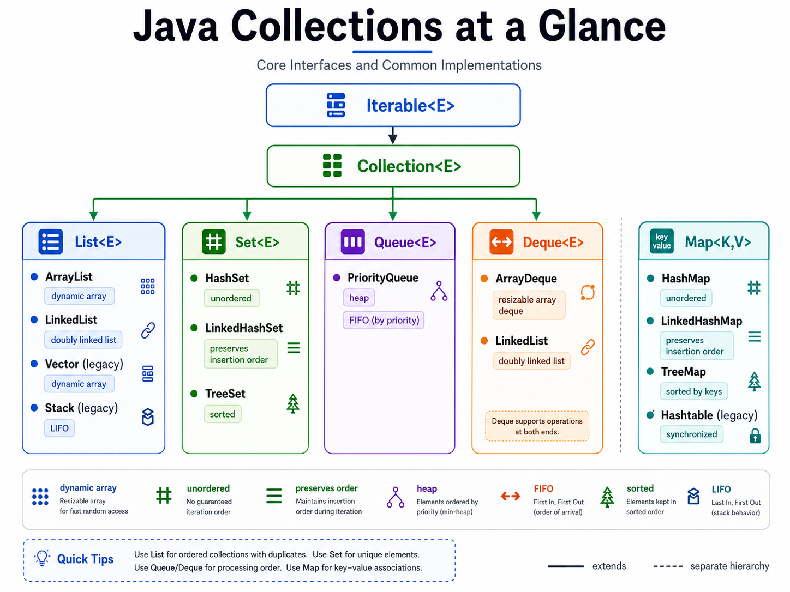

## Data Structure Review 🐱

My Java notes for LeetCode and interview prep.

This README focuses on the Java data structures and patterns I use most often in coding interviews.

----------

# Table of Contents

-   [Quick Java Cheat Sheet](#quick-java-cheat-sheet)
    
-   [Big Picture: Interface vs Class vs Object](#big-picture-interface-vs-class-vs-object)
    
-   [List](#list)
    
    -   [ArrayList](#arraylist)
        
    -   [LinkedList](#linkedlist)
        
-   [Stack (LIFO)](#stack-lifo)
    
-   [Queue (FIFO)](#queue-fifo)
    
-   [Deque](#deque)
    
-   [PriorityQueue / Heap](#priorityqueue--heap)
    
    -   [Min Heap](#min-heap)
        
    -   [Max Heap](#max-heap)
        
-   [Set](#set)
    
    -   [HashSet](#hashset)
        
-   [Map](#map)
    
    -   [HashMap](#hashmap)
        
    -   [LinkedHashMap](#linkedhashmap)
        
    -   [TreeMap](#treemap)
        
-   [Common Time Complexities](#common-time-complexities)
    
-   [Generics in Java (`<>`)](#generics-in-java)
    
-   [Primitive vs Wrapper Types](#primitive-vs-wrapper-types)
    
-   [Common LeetCode Patterns](#common-leetcode-patterns)
    
-   [Useful Java Syntax for LeetCode](#useful-java-syntax-for-leetcode)
    




# Quick Java Cheat Sheet

## My default choices for LeetCode

### Dynamic array

```java
List<Integer> list = new ArrayList<>();

```

### Stack (LIFO)

```java
Deque<Integer> stack = new ArrayDeque<>();
stack.push(1);
stack.pop();
stack.peek();

```

### Queue (FIFO)

```java
Queue<Integer> queue = new ArrayDeque<>();
queue.offer(1);
queue.poll();
queue.peek();

```

### Min heap

```java
PriorityQueue<Integer> minHeap = new PriorityQueue<>();

```

### Max heap

```java
PriorityQueue<Integer> maxHeap = new PriorityQueue<>((a, b) -> Integer.compare(b, a));

```

### Set

```java
Set<Character> set = new HashSet<>();

```

### Map

```java
Map<Integer, Integer> map = new HashMap<>();

```

## Quick memory rule 

-   Need indexed dynamic array -> `ArrayList`
    
-   Need stack -> `Deque + ArrayDeque`
    
-   Need queue -> `Queue/Deque + ArrayDeque`
    
-   Need smallest/largest by priority -> `PriorityQueue`
    
-   Need uniqueness -> `HashSet`
    
-   Need key/value lookup -> `HashMap`
    

----------

# Big Picture: Interface vs Class vs Object

## Class

A **class** is a blueprint.

Example:

```java
class Dog {
    String name;

    void bark() {
        System.out.println("Woof");
    }
}

```

## Object

An **object** is an actual instance created from a class.

```java
Dog d = new Dog();

```

## Interface

An **interface** is a contract. It tells us what operations something supports.

Examples in Java Collections:

-   `List`
    
-   `Set`
    
-   `Map`
    
-   `Queue`
    
-   `Deque`
    

These are interfaces, so we usually cannot do:

```java
List<Integer> list = new List<>();   // wrong

```

Instead, we create an object from a concrete class:

```java
List<Integer> list = new ArrayList<>();
Queue<Integer> queue = new ArrayDeque<>();
Map<Integer, Integer> map = new HashMap<>();

```

## Common Java interview style

Use the interface type on the left, implementation on the right.

```java
List<Integer> list = new ArrayList<>();
Set<Integer> set = new HashSet<>();
Map<Integer, Integer> map = new HashMap<>();
Queue<Integer> queue = new ArrayDeque<>();
Deque<Integer> stack = new ArrayDeque<>();

```

This is flexible and considered good Java style.

----------

# List

A `List` is an ordered collection.

## Features

-   Keeps insertion order
    
-   Allows duplicates
    
-   Supports indexed access
    

## Common implementations

-   `ArrayList`
    
-   `LinkedList`
    

Example:

```java
List<Integer> list = new ArrayList<>();
list.add(10);
list.add(20);
System.out.println(list.get(0));

```

----------

# ArrayList

`ArrayList` is the most common `List` implementation in LeetCode.

## When to use

-   Need dynamic array behavior
    
-   Need fast `get(index)`
    
-   Need to append to the end often
    

## Common operations

```java
List<Integer> list = new ArrayList<>();

list.add(5);          // add to end
list.add(0, 3);       // add at index
list.get(1);          // get by index
list.set(1, 10);      // replace
list.remove(1);       // remove by index
list.size();          // current size
list.isEmpty();       // whether empty

```

## Time complexity

-   `get(i)` -> `O(1)`
    
-   `add(x)` at end -> usually `O(1)` amortized
    
-   `add(i, x)` -> `O(n)`
    
-   `remove(i)` -> `O(n)`
    

----------

# LinkedList

`LinkedList` is a doubly linked list implementation in Java.

It implements:

-   `List`
    
-   `Deque`
    
-   `Queue`
    

## When to use

In LeetCode, I usually do **not** default to `LinkedList`.

For queue/stack use cases, I usually prefer `ArrayDeque`.

## Example

```java
LinkedList<Integer> list = new LinkedList<>();
list.add(1);
list.add(2);
list.addFirst(0);
list.addLast(3);

```

## Note

Even though `LinkedList` can be used as a queue or deque, `ArrayDeque` is often a better default for interviews.

----------

# Stack (LIFO)

A stack is **Last In, First Out**.

Example:

-   push 1
    
-   push 2
    
-   push 3
    
-   pop -> 3
    

## Common LeetCode use cases

-   Valid Parentheses
    
-   Monotonic Stack
    
-   DFS iterative
    
-   Reverse Polish Notation
    

## Old Java style

```java
Stack<Integer> stack = new Stack<>();

```

## Preferred modern style

```java
Deque<Integer> stack = new ArrayDeque<>();

```

## Stack operations

```java
stack.push(10);
stack.push(20);
stack.peek();      // 20
stack.pop();       // removes 20
stack.isEmpty();

```

## Why prefer `Deque` over `Stack`

-   `Stack` is older
    
-   `Deque + ArrayDeque` is cleaner and more modern
    
-   Very common in interviews and LeetCode
    

----------

# Queue (FIFO)

A queue is **First In, First Out**.

Example:

-   offer 1
    
-   offer 2
    
-   offer 3
    
-   poll -> 1
    

## Common LeetCode use cases

-   BFS
    
-   Binary Tree Level Order Traversal
    
-   Shortest path in unweighted graph
    
-   Processing in arrival order
    

## Preferred style

```java
Queue<Integer> queue = new ArrayDeque<>();

```

## Queue operations

```java
queue.offer(10);
queue.offer(20);
queue.peek();      // 10
queue.poll();      // removes 10
queue.isEmpty();

```

## `offer` vs `add`

Both insert elements, but for queue usage I prefer:

-   `offer()`
    
-   `poll()`
    
-   `peek()`
    

This makes the queue behavior clearer.

----------

# Deque

`Deque` means **double-ended queue**.

It can add/remove from both ends.

## Important

`Deque` is an **interface**, not a class.

Usually I use:

```java
Deque<Integer> dq = new ArrayDeque<>();

```

## Why `Deque` is useful

A deque can be used as both:

-   a stack
    
-   a queue
    

## As a stack

```java
Deque<Integer> stack = new ArrayDeque<>();
stack.push(1);
stack.push(2);
stack.pop();
stack.peek();

```

## As a queue

```java
Deque<Integer> queue = new ArrayDeque<>();
queue.offer(1);
queue.offer(2);
queue.poll();
queue.peek();

```

## Common methods

### Front side

-   `addFirst(x)`
    
-   `offerFirst(x)`
    
-   `removeFirst()`
    
-   `pollFirst()`
    
-   `peekFirst()`
    

### Back side

-   `addLast(x)`
    
-   `offerLast(x)`
    
-   `removeLast()`
    
-   `pollLast()`
    
-   `peekLast()`
    

## Most useful interview idea

For most stack/queue problems, `ArrayDeque` is my default.

----------

# PriorityQueue / Heap

A `PriorityQueue` is used when removal is based on **priority**, not insertion order.

## Important

A `PriorityQueue` is **not** a normal FIFO queue.

It does **not** behave like:

-   queue (FIFO)
    
-   stack (LIFO)
    

It removes based on priority.

## Common LeetCode use cases

-   Top K Frequent Elements
    
-   Kth Largest Element
    
-   Merge K Sorted Lists
    
-   Smallest / largest repeatedly
    

## Basic idea

Java uses `PriorityQueue` for heap behavior.

-   default `PriorityQueue` -> min heap
    
-   custom comparator -> can make max heap
    

----------

# Min Heap

Java `PriorityQueue` is a **min heap by default**.

```java
PriorityQueue<Integer> minHeap = new PriorityQueue<>();
minHeap.offer(5);
minHeap.offer(2);
minHeap.offer(8);

System.out.println(minHeap.peek()); // 2
System.out.println(minHeap.poll()); // 2

```

## Meaning

The smallest element has the highest priority.

----------

# Max Heap

To make a max heap in Java, provide a comparator.

```java
PriorityQueue<Integer> maxHeap = new PriorityQueue<>((a, b) -> Integer.compare(b, a));

```

Example:

```java
maxHeap.offer(5);
maxHeap.offer(2);
maxHeap.offer(8);

System.out.println(maxHeap.peek()); // 8
System.out.println(maxHeap.poll()); // 8

```

## Heap operations

```java
pq.offer(x);   // insert
pq.peek();     // view top
pq.poll();     // remove top
pq.isEmpty();

```

## Time complexity

-   `offer` -> `O(log n)`
    
-   `poll` -> `O(log n)`
    
-   `peek` -> `O(1)`
    

## Custom comparator example

For Top K Frequent Elements:

```java
PriorityQueue<Integer> maxHeap = new PriorityQueue<>(
    (a, b) -> Integer.compare(freq.get(b), freq.get(a))
);

```

Meaning:

-   store numbers in heap
    
-   compare them by frequency
    
-   larger frequency comes first
    

----------

# Set

A `Set` stores unique elements.

## Features

-   no duplicates
    
-   membership check is often fast
    

## Common use cases

-   remove duplicates
    
-   check existence
    
-   visited set in graph/tree problems
    

----------

# HashSet

`HashSet` is the most common set in LeetCode.

## Example

```java
Set<Integer> set = new HashSet<>();
set.add(1);
set.add(2);
set.add(2);    // duplicate, ignored

set.contains(1);
set.remove(1);

```

## Time complexity

Average case:

-   `add` -> `O(1)`
    
-   `contains` -> `O(1)`
    
-   `remove` -> `O(1)`
    

Worst case can degrade, but average `O(1)` is the standard interview answer.

----------

# Map

A `Map` stores key/value pairs.

Examples:

-   frequency counting
    
-   value to index lookup
    
-   caching computed results
    

## Common implementations

-   `HashMap`
    
-   `LinkedHashMap`
    
-   `TreeMap`
    

----------

# HashMap

`HashMap` is the most common map in LeetCode.

## Example

```java
Map<Integer, Integer> map = new HashMap<>();
map.put(1, 10);
map.put(2, 20);

map.get(1);              // 10
map.containsKey(2);      // true
map.getOrDefault(3, 0);  // 0
map.remove(2);

```

## Duplicate keys

If I do:

```java
map.put(2, 0);
map.put(2, 3);

```

then key `2` gets overwritten, and the new value becomes `3`.

## Time complexity

Average case:

-   `put` -> `O(1)`
    
-   `get` -> `O(1)`
    
-   `containsKey` -> `O(1)`
    
-   `remove` -> `O(1)`
    

----------

# LinkedHashMap

`LinkedHashMap` keeps insertion order.

## When to use

-   Need map behavior
    
-   Also need to preserve insertion order
    

Example:

```java
Map<Integer, String> map = new LinkedHashMap<>();

```

----------

# TreeMap

`TreeMap` keeps keys sorted.

## When to use

-   Need sorted keys
    
-   Need ordered map behavior
    

Example:

```java
Map<Integer, String> map = new TreeMap<>();

```

## Time complexity

-   `put` -> `O(log n)`
    
-   `get` -> `O(log n)`
    
-   `remove` -> `O(log n)`
    

----------

# Common Time Complexities

## Array / ArrayList

-   access by index -> `O(1)`
    
-   append -> `O(1)` amortized
    
-   insert/remove in middle -> `O(n)`
    

## LinkedList

-   add/remove at ends -> often `O(1)`
    
-   access by index -> `O(n)`
    

## HashMap / HashSet

Average case:

-   `put`, `get`, `contains`, `remove` -> `O(1)`
    

## TreeMap / TreeSet

-   `O(log n)` for core operations
    

## Heap / PriorityQueue

-   insert -> `O(log n)`
    
-   remove top -> `O(log n)`
    
-   peek top -> `O(1)`
    

----------

# Generics in Java

The part inside `<>` is the type the collection stores.

## Examples

### List of integers

```java
List<Integer> nums = new ArrayList<>();

```

### Set of characters

```java
Set<Character> seen = new HashSet<>();

```

### Map from integer to integer

```java
Map<Integer, Integer> freq = new HashMap<>();

```

### Queue of tree nodes

```java
Queue<TreeNode> queue = new ArrayDeque<>();

```

### List of lists of strings

```java
List<List<String>> result = new ArrayList<>();

```

## Diamond operator

```java
List<Integer> nums = new ArrayList<>();

```

The empty `<>` on the right means Java can infer the type from the left side.

----------

# Primitive vs Wrapper Types

## Primitive

-   `int`
    
-   `char`
    
-   `boolean`
    
-   `double`
    

## Wrapper class

-   `Integer`
    
-   `Character`
    
-   `Boolean`
    
-   `Double`
    

## Rule

Use primitive types by default.

Use wrapper types when:

-   generics require objects
    
-   value may need to be `null`
    

## Examples

### Primitive variable

```java
int x = 5;

```

### List must use wrapper type

```java
List<Integer> list = new ArrayList<>();

```

### Wrong

```java
List<int> list = new ArrayList<>();   // invalid

```

----------

# Common LeetCode Patterns

## 1. Frequency counting

Use `HashMap`

```java
Map<Integer, Integer> freq = new HashMap<>();
for (int num : nums) {
    freq.put(num, freq.getOrDefault(num, 0) + 1);
}

```

## 2. Fast membership check

Use `HashSet`

```java
Set<Character> seen = new HashSet<>();

```

## 3. BFS

Use queue

```java
Queue<TreeNode> queue = new ArrayDeque<>();

```

## 4. DFS iterative / stack problems

Use `Deque`

```java
Deque<TreeNode> stack = new ArrayDeque<>();

```

## 5. Top K / repeatedly get smallest or largest

Use `PriorityQueue`

```java
PriorityQueue<Integer> minHeap = new PriorityQueue<>();
PriorityQueue<Integer> maxHeap = new PriorityQueue<>((a, b) -> Integer.compare(b, a));

```

----------

# Useful Java Syntax for LeetCode

## Max in `int[]`

```java
int max = Arrays.stream(nums).max().getAsInt();

```

## Min in `int[]`

```java
int min = Arrays.stream(nums).min().getAsInt();

```

## Sort `int[]`

```java
Arrays.sort(nums);

```

## Sort 2D array by first element

```java
Arrays.sort(intervals, (a, b) -> Integer.compare(a[0], b[0]));

```

## String to char array

```java
char[] arr = s.toCharArray();

```

## Sort chars in string

```java
char[] arr = s.toCharArray();
Arrays.sort(arr);
String sorted = new String(arr);

```

## Convert map values to list

```java
List<List<String>> result = new ArrayList<>(map.values());

```

## Iterate through map

```java
for (int key : map.keySet()) {
    System.out.println(key + " -> " + map.get(key));
}

```

## Enhanced for loop

```java
for (int num : nums) {
    System.out.println(num);
}

```

----------

# Final Notes

## My Java defaults for interview prep

### Stack

```java
Deque<Integer> stack = new ArrayDeque<>();

```

### Queue

```java
Queue<Integer> queue = new ArrayDeque<>();

```

### Heap

```java
PriorityQueue<Integer> pq = new PriorityQueue<>();

```

### Dynamic array

```java
List<Integer> list = new ArrayList<>();

```

### Hash lookup

```java
Map<Integer, Integer> map = new HashMap<>();
Set<Integer> set = new HashSet<>();

```

## Short summary

-   `ArrayList` -> dynamic array
    
-   `Deque + ArrayDeque` -> stack or queue
    
-   `PriorityQueue` -> heap
    
-   `HashSet` -> uniqueness / membership
    
-   `HashMap` -> key/value lookup
    

----------
